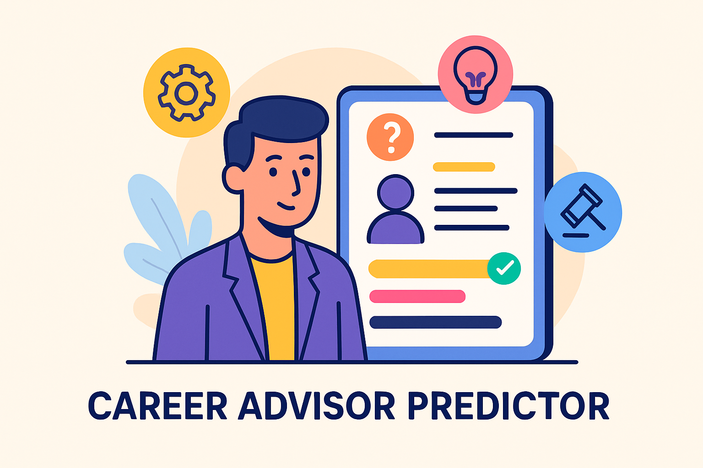

# Smart Career Advisor 🎯

## Project Screenshot

  

# 🎯 Smart Career Advisor: Your Personal AI Career Guide

> **An intelligent AI-powered application that predicts the best career paths based on your skills, education, experience, and interests. Built with Streamlit and Machine Learning.**

---

## 🌟 Why Smart Career Advisor?

Choosing a career is one of the most crucial decisions in life — yet many students and young professionals struggle to find the right path due to lack of guidance, awareness, or resources.  
**Smart Career Advisor** steps in as a personalized career mentor, empowering individuals to discover their ideal career trajectories with clarity and confidence.

---

## 🚀 Key Highlights

- **Top 2 Career Predictions:** Instantly get the best-matched career options based on your personal profile.
- **Personalized Career Roadmap:** Clear guidance on what skills to develop from beginner to mastery levels.
- **Smart Institute Recommendations:** Find where to upgrade your skills for your desired career.
- **Simple Chatbot Interaction:** A friendly, intuitive experience for users of any background.
- **Early Career Awareness:** Ideal for students from high school to university level to plan their futures wisely.

---

## 🧠 How It Works

1. **Input Your Profile:** Skills, Degree, Experience, Interests
2. **AI-Powered Prediction:** ML model suggests top 2 suitable careers
3. **Career Roadmap:** Step-by-step plan for skill development
4. **Institute Suggestion:** Places where you can sharpen your abilities
5. **Career Guidance:** Full plan to achieve your dream job

---

## 💡 Technologies Behind It

- **Python** — Core Programming
- **Scikit-learn** — Machine Learning Model
- **Streamlit** — Interactive Web Application
- **Pickle** — Model Serialization

---

## 🎯 Career Domains Covered

- Data Scientist
- Nurse
- AI Engineer
- Graphic Designer
- Mechanical Engineer
- Digital Marketer
- Web Developer
- Teacher
- Business Analyst
- Accountant

> Each career comes with a **customized skill roadmap** and **institution recommendations**.

---

## 🔮 Future Vision

- Integrate a full-fledged **Career ChatBot** powered by NLP.
- Provide **Resume Building Tips** aligned to selected careers.
- Expand to cover **emerging industries** like Green Energy, Blockchain, Data Ethics.
- Analyze **real-time job market trends** for smarter predictions.

---
## Resume Recommendation System
Overview:
The Resume Recommendation System is designed to help individuals optimize their resumes and match them to relevant job opportunities using machine learning techniques. This system processes user resumes, cleans the text, and provides recommendations based on the resume content, including skills, experience, and job titles.

### Key Features:
Text Cleaning:

The system performs data preprocessing to clean the text by removing stop words, special characters, and irrelevant information.

It also handles missing values, ensuring that the resume data is ready for model training.

Feature Engineering:

Level Encoding: Categorical features, such as job titles and industries, are encoded using Level Encoding to convert them into numerical values, making them suitable for machine learning models.

TF-IDF Vectorization: The TF-IDF (Term Frequency-Inverse Document Frequency) vectorizer is used to transform the text data into numerical vectors that capture the importance of words in relation to the entire dataset.

Random Forest Classifier:

The system uses the Random Forest Classifier model to predict and recommend suitable job positions based on the user's resume data.

Random Forest is an ensemble learning method that uses multiple decision trees to improve accuracy and reduce overfitting, ensuring more reliable recommendations.

## Resume Matching and Recommendations:

The trained model matches the user’s resume to various job roles and suggests improvements to increase the chances of landing a job in the desired field.

The system identifies key skills, qualifications, and experience required for specific job roles and recommends actions such as adding or updating certain skills or experiences in the resume.

### Technologies Used:
Python

Pandas (for data manipulation)

Scikit-learn (for machine learning models and text preprocessing)

TF-IDF Vectorizer (for text feature extraction)

Random Forest Classifier (for job recommendation predictions)

How It Works:
Input: Users upload their resumes in a readable format (e.g., text or PDF).

Preprocessing: The system cleans the text data, removes unnecessary characters, and performs Level Encoding for categorical features and TF-IDF for text features.

Model Training: A Random Forest Classifier is trained on a Kaggle dataset containing sample job listings and resume features. The model learns to correlate resume features with job roles.

## Recommendation: Once the model is trained, users can submit their resumes, and the system will recommend job positions based on the content of the resumes. The model will also provide feedback on how to improve the resume for better alignment with industry requirements.

## 🏆 Impact

By bridging the gap between **student aspirations** and **real-world skill requirements**,  
**Smart Career Advisor** has the potential to be a **trusted digital mentor** for educational institutions, career counselors, and individual learners globally.

---

## 🤝 Acknowledgements

Special thanks to the **Daffodil International Professional Training Institute (DIPTI)** for their contribution in educational recommendations.

---
  
> ✨ *Empowering Dreams, One Career at a Time!* ✨

---

# ✍️ Created with passion by [Roman Ahmed]

---

---

---

